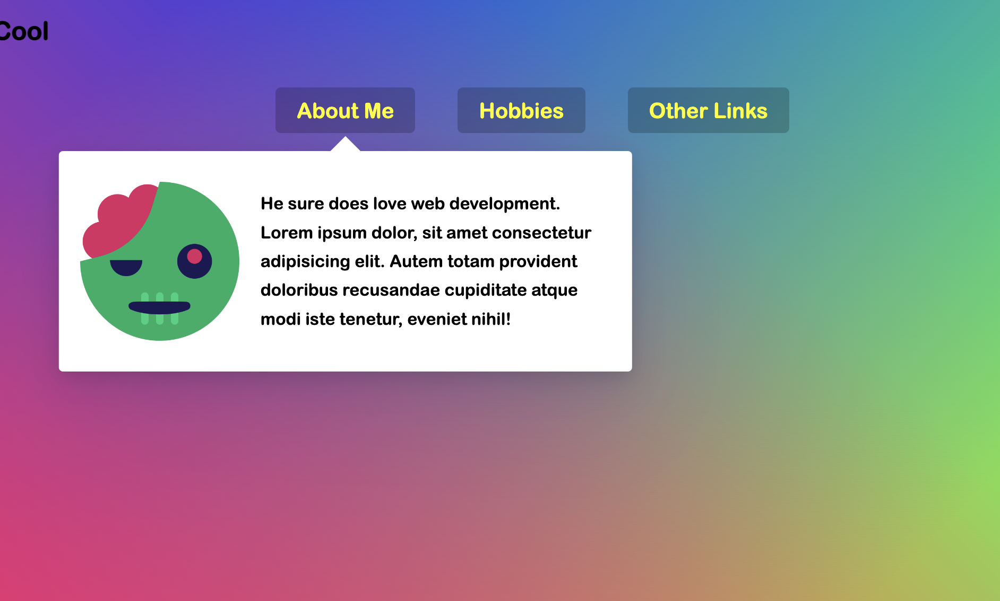

# Stripe-Follow-Along-Nav

This is a 30-days javascript grinding  
js30 [https://github.com/ningh98/js30]  
26. Stripe-Follow-Along-Nav [https://github.com/ningh98/Stripe-Follow-Along-Nav]

## Table of contents

- [Overview](#overview)
  - [Screenshot](#screenshot)
  - [Links](#links)
- [My process](#my-process)
  - [Built with](#built-with)
  - [What I learned](#what-i-learned)


## Overview

The script adds dynamic behavior to the navigation menu, making the dropdown background follow the hovered item and adjusting its size and position accordingly.

### Screenshot




### Links

- Live Site URL: [https://ningh98.github.io/Stripe-Follow-Along-Nav/]

## My process

### Built with

- HTML
- CSS
- Javascript


### What I learned


```js
const triggers = document.querySelectorAll('.cool > li')
  const background = document.querySelector('.dropdownBackground')
  const nav = document.querySelector('.top')

  function handleEnter() {
    this.classList.add('trigger-enter')
    setTimeout(() =>this.classList.contains('trigger-enter') &&  
      this.classList.add('trigger-enter-active'), 150)
    background.classList.add('open')

    const dropdown = this.querySelector('.dropdown')
    const dropdownCoords = dropdown.getBoundingClientRect()
    const navCoords = nav.getBoundingClientRect()
    
    const coords = {
      height: dropdownCoords.height,
      width: dropdownCoords.width,
      top: dropdownCoords.top - navCoords.top,
      left: dropdownCoords.left - navCoords.left,
    }

    background.style.setProperty('width', `${coords.width}px`)
    background.style.setProperty('height', `${coords.height}px`)
    background.style.setProperty('transform', `translate(${coords.left}px, ${coords.top}px)`)
  }
  function handleLeave(){
    this.classList.remove('trigger-enter', 'trigger-enter-active')
    background.classList.remove('open')
    
  }

  triggers.forEach(trigger => trigger.addEventListener('mouseenter', handleEnter))
  triggers.forEach(trigger => trigger.addEventListener('mouseleave', handleLeave))

```
